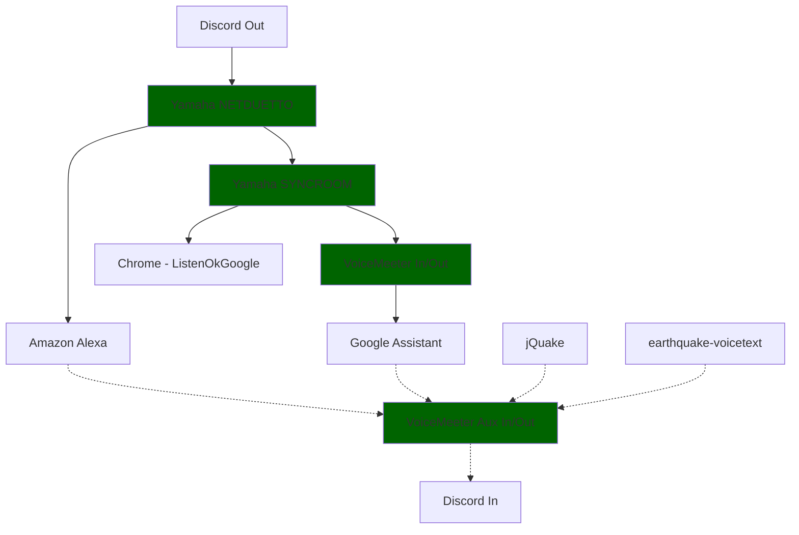

# サウンドフロー

```mermaid
graph TB
  %% ドライバの定義
  YamahaNetduetto[Yamaha NETDUETTO]
  YamahaSyncRoom[Yamaha SYNCROOM]
  VBAudio[VoiceMeeter In/Out]
  VBAudioAux[VoiceMeeter Aux In/Out]

  %% ドライバの色定義
  style YamahaNetduetto fill:darkgreen
  style YamahaSyncRoom fill:darkgreen
  style VBAudio fill:darkgreen
  style VBAudioAux fill:darkgreen

  %% アプリケーションの定義
  DiscordOut[Discord Out]
  DiscordIn[Discord In]
  Alexa[Amazon Alexa]
  Chrome[Chrome - ListenOkGoogle]
  GoogleAssistant[Google Assistant]
  jQuake[jQuake]
  EarthquakeVoiceText[earthquake-voicetext]

  %% サウンドフロー
  DiscordOut-->YamahaNetduetto

  YamahaNetduetto-->Alexa
  YamahaNetduetto-->YamahaSyncRoom

  YamahaSyncRoom-->Chrome
  YamahaSyncRoom-->VBAudio

  VBAudio-->GoogleAssistant

  Alexa-.->VBAudioAux
  GoogleAssistant-.->VBAudioAux
  jQuake-.->VBAudioAux
  EarthquakeVoiceText-.->VBAudioAux

  VBAudioAux-.->DiscordIn
```
